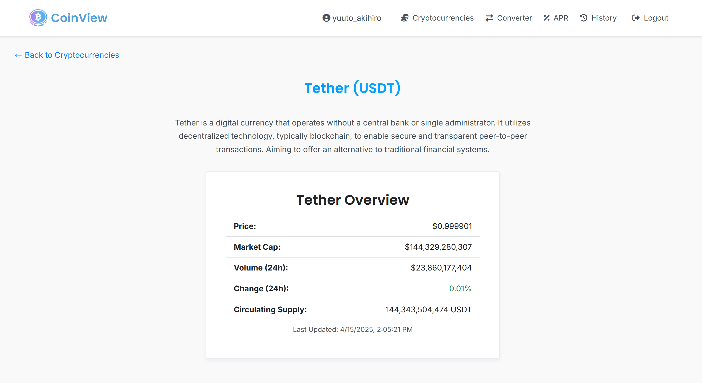

# CoinView Application

---

## Table of Contents

1. [Project Info](#project-info)
2. [Project Preview](#project-preview)
   - [Overview](#overview)
   - [Responsive Design](#responsive-design)
3. [Setup & Installation](#setup--installation)
4. [Technologies Used](#technologies-used)
5. [Author](#author)

## Project Info

**Name:** CoinView  
**Version:** 1.0.0  

**CoinView** is a modern and responsive cryptocurrency web application that allows users to:

- View real-time data for all major cryptocurrencies.
- Access detailed statistics and coin information.
- Convert one cryptocurrency into another using live rates.
- Calculate long-term returns using an APR calculator.
- Track your recent conversions with a built-in history feature.
- Authenticate securely via Google and GitHub using JWT token-based authentication.

It is built with a focus on user experience, responsiveness across devices, and speed via single-page application techniques.

---

## Project Preview

### Overview

| Welcome | Welcome 2 |
|--------|------------|
|  |  |

| Cryptocurrencies | Detail |
|------------------|--------|
|  |  |

| Converter | APR |
|-----------|-----|
|  |  |

| History | Login |
|--------|--------|
|  |  |

### Responsive Design

| Crypto List (Mobile)                           |  Converter (Mobile)                       | APR (Mobile) |
|------------------------------------------------|------------------------------------------|------------------------------------------|
|  |  |  |  

---

## Setup & Installation

Follow the steps below to get CoinView running locally on your machine:

---

### Step 1: Clone the Repository

```bash
   git clone https://github.com/yuutoa/coin-view-webapp.git
   cd coin-view-webapp
```

### Step 2: Create and Activate a Virtual Environment

```bash
   python -m venv .venv
   .venv\Scripts\activate
```

### Step 3: Install Dependencies

```bash
  pip install -r requirements.txt
```

### Step 4: Set Up Environment Variables

Create a .env file in the root directory and add the following variables:

Required
```env 
SECRET_KEY=your-django-secret-key

# SQLite (default)
DATABASE_ENGINE=sqlite3
DATABASE_NAME=./fallback.sqlite3
```

Or for PostgreSQL:
```env
DATABASE_ENGINE=postgresql
DATABASE_NAME=your_db_name
DATABASE_USER=your_db_user
DATABASE_PASSWORD=your_db_password
DATABASE_HOST=localhost
DATABASE_PORT=5432
```

OAuth Setup (for Google & GitHub login):
```env
# Google: https://console.cloud.google.com/apis/credentials
GOOGLE_CLIENT_ID=your_google_client_id
GOOGLE_CLIENT_SECRET=your_google_client_secret

# GitHub: https://github.com/settings/developers
GITHUB_CLIENT_ID=your_github_client_id
GITHUB_CLIENT_SECRET=your_github_client_secret
```

### Step 6: Run Database Migrations
```bash
   python manage.py migrate
```

### Step 7: Run the Development Server
```
   python manage.py runserver
```
Open your browser and go to: http://localhost:8000

---

## Technologies Used

- Django
- Django REST Framework
- Simple JWT
- AllAuth + dj-rest-auth
- HTML5, CSS3, JavaScript (Fetch API)
- PostgreSQL / SQLite
- Google & GitHub OAuth2

---

## Author

Made with care by [Yuuto Akihiro](https://github.com/yuutoa)
